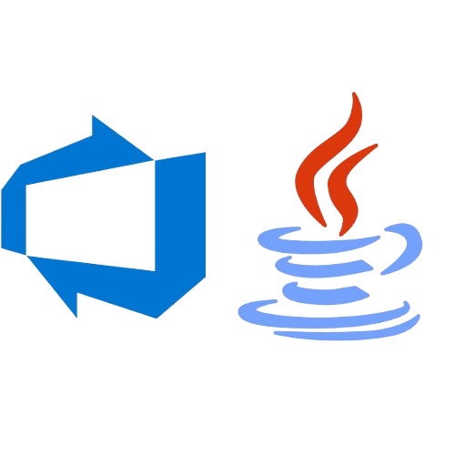

<a name="readme-top"></a>


<div align="center">

[![Contributors][contributors-shield]][contributors-url]
[![Forks][forks-shield]][forks-url]
[![Stargazers][stars-shield]][stars-url]
[![Issues][issues-shield]][issues-url]


[Spanish](#documentación-en-español)
[English](#english-documentation)

### English documentation

# Create Azure Devops task with Java usinng API 

<a href="https://github.com/luig2-prog/azure-task">
  
</a>

If you need to create many tasks in Azure Devops and don't want to create them one by one, you can use this project. Using an Excel file with the information you can create tasks in a short time. For more information visit [Azure Documentation](https://learn.microsoft.com/en-us/rest/api/azure/devops/wit/work-items?view=azure-devops-rest-7.1)

</div>

## Main Features

- **Creating tasks in Azure by filling out an excel file**: You can create N number of tasks by filling out an excel file and executing the project

<p align="right">(<a href="#readme-top">go back up</a>)</p>

## To initialize

### Prerequisites

- OpenJDK see [official documentation](https://openjdk.org/projects/jdk/22/)

  ```sh
    java -version
  ```

- Maven see [official documentation](https://maven.apache.org/download.cgi)

  ```sh
    mvn -version
  ```

### Installation

1. Clone the repository

   ```sh
   git clone https://github.com/luig2-prog/azure-task.git
   ```

#### Steps in command console

1. Go to the root of the project and run the following command

   ```sh
   mvn clean package
   ```

2. Fill the information in the task.xlsx file

3. Execute the generated .jar file

    ```sh
    java -jar /target/azure-task-1.0-SNAPSHOT.jar
    ```


<p align="right">(<a href="#readme-top">go back up</a>)</p>

## Contribute to the project

Contributions are the engine that drives the open source community, by creating and teaching we learn much more. Every contribution you make is immensely valued. If you dare, thank you very much for being part of this journey of collaboration and discovery

Any contributions you make are **greatly appreciated**!

If you have any suggestions or improvements to the project please create a [_fork_](https://github.com/luig2-prog/azure-task/fork) of the repository and create a [_pull request_](https://github. com/luig2-prog/azure-task/pulls). You can also just open a [_issue_](https://github.com/luig2-prog/azure-task/issues) with the tag "enhancement".

Here's a quick guide:

1. Make a [_fork_](https://github.com/luig2-prog/azure-task/fork) of the Project
2. Clone your [_fork_](https://github.com/luig2-prog/azure-task/fork) (`git clone <fork URL>`)
3. Add the original repository as remote (`git remote add upstream <URL of the original repository>`)
4. Create your Feature Branch (`git switch -c feature/CaracteristicaIncreible`)
5. Make your Changes (`git commit -m 'Add: someAwesomeFeature'`)
6. Push the Branch (`git push origin feature/CaracteristicaIncreible`)
7. Open a [_pull request_](https://github.com/luig2-prog/azure-task/pulls)

<div align="center">

<hr>

### Documentación en español

# Crear tarea de Azure Devops con Java usando la API de Azure Devops

<a href="https://github.com/luig2-prog/azure-task">
 
</a>

Si necesita crear muchas tareas en Azure Devops y no desea crearlas una por una, puede usar este proyecto. Utilizando un archivo Excel con la información podrás crear tareas en poco tiempo. Para obtener más información, visite [Documentación de Azure](https://learn.microsoft.com/en-us/rest/api/azure/devops/wit/work-items?view=azure-devops-rest-7.1)

</div>

## Principales características

- **Creación de tareas en Azure completando un archivo de Excel**: Puede crear N número de tareas completando un archivo de Excel y ejecutando el proyecto.

<p align="right">(<a href="#readme-top">volver arriba</a>)</p>

## Para inicializar

### Requisitos previos

- OpenJDK ver [documentación oficial](https://openjdk.org/projects/jdk/22/)

    ```sh
    java -version
    ```

- Maven consulte [documentación oficial] (https://maven.apache.org/download.cgi)

    ```sh
    mvn -version
    ```

### Instalación

1. Clonar el repositorio

 ```sh
 git clone https://github.com/luig2-prog/azure-task.git
 ```

#### Pasos en la consola de comandos

1. Vaya a la raíz del proyecto y ejecute el siguiente comando

 ```sh
  mvn clean package
 ```

2. Complete la información en el archivo task.xlsx.

3. Ejecute el archivo .jar generado.

 ```sh
 java -jar /target/azure-task-1.0-SNAPSHOT.jar
 ```


<p align="right">(<a href="#readme-top">volver arriba</a>)</p>

## Contribuir al proyecto

Las contribuciones son el motor que impulsa a la comunidad de código abierto, creando y enseñando aprendemos mucho más. Cada contribución que haces es inmensamente valorada. Si te animas, muchas gracias por ser parte de este viaje de colaboración y descubrimiento.

¡Cualquier contribución que hagas será **muy apreciada**!

Si tiene alguna sugerencia o mejora para el proyecto, cree un [_fork_](https://github.com/luig2-prog/azure-task/fork) del repositorio y cree una [_pull request_](https:// github.com/luig2-prog/azure-task/pulls). También puede simplemente abrir un [_issue_](https://github.com/luig2-prog/azure-task/issues) con la etiqueta "mejora".

Aquí tienes una guía rápida:

1. Haga un [_fork_](https://github.com/luig2-prog/azure-task/fork) del Proyecto
2. Clona tu [_fork_](https://github.com/luig2-prog/azure-task/fork) (`git clone <fork URL>`)
3. Agregue el repositorio original como remoto (`git remoto agregar upstream <URL del repositorio original>`)
4. Cree su rama de funciones (`git switch -c feature/IncreibleCharacteristic`)
5. Realice sus cambios (`git commit -m 'Add: someAwesomeFeature'`)
6. Empuje la rama (`git push origin feature/CaracteristicaIncreible`)
7. Abra una [_solicitud de extracción_] (https://github.com/luig2-prog/azure-task/pulls)

**Collaborators!**

[](https://github.com/luig2-prog/azure-task/graphs/contributors)

<p align="right">(<a href="#readme-top">volver arriba</a>)</p>


## 🛠️ Stack

 [![Java][java-badge]][java-url]

 ![Apache Maven][maven-url]

<p align="right">(<a href="#readme-top">volver arriba</a>)</p>

[astro-url]: https://docs.oracle.com/en/java/

[java-url]: https://tailwindcss.com/
[maven-url]: https://img.shields.io/badge/Apache%20Maven-C71A36?style=for-the-badge&logo=Apache%20Maven&logoColor=white
[java-badge]: https://img.shields.io/badge/Java-ED8B00?style=for-the-badge&logo=openjdk&logoColor=white
[contributors-shield]: https://img.shields.io/github/contributors/luig2-prog/azure-task.svg?style=for-the-badge
[contributors-url]: https://github.com/luig2-prog/azure-task/graphs/contributors
[forks-shield]: https://img.shields.io/github/forks/midudev/la-velada-web-oficial.svg?style=for-the-badge
[forks-url]: https://github.com/luig2-prog/azure-task/network/members
[stars-shield]: https://img.shields.io/github/stars/luig2-prog/azure-task.svg?style=for-the-badge
[stars-url]: https://github.com/luig2-prog/azure-task/stargazers
[issues-shield]: https://img.shields.io/github/issues/midudev/la-velada-web-oficial.svg?style=for-the-badge
[issues-url]: https://github.com/luig2-prog/azure-task/issues
